[TOC]

# 三阶段 VUE 项目  《贝思客》 《后台管理系统》

## 项目介绍  

## 项目分工 
* 邢海龙(组长)
    - 负责列表详情页，购买商品评论，主页跳转不同的商品的促销的界面的搭建，购买界面等多个界面
* 吴诗雯
    - 负责主页，列表页，购物车的界面的搭建和数据获取和数据的传输
* 罗涛 
    - 负责登陆界面，注册界面的制作，我的商品的界面的制作
* 李浩明
    - 负责项目的后台管理系统的搭建，数据的传入和更改，负责项目中的接口的调试和项目上线等多操作

#### 项目类型 电商类网站（主营糕点，甜品）
- 演示地址
    - 项目原地址 http://m.bestcake.com/
    - 项目地址为云服务器地址
        - 项目地址 
            * >项目地址 http://118.31.77.168:3002
        - 后台地址
            * >后台地址 http://118.31.77.168:3003
        - 服务器代理
            * >服务器代理地址 http://118.31.77.168:3004
        - 资源请求 
            * >项目资源请求地址 http://118.31.77.168:3001
        - 后台测试账号
            * >账号：lhm  密码：123456
    - github 地址
        - git@github.com:gzh51910/bestCake.git
##### 主界面 s如下c目录
    >   
        │  App.vue
        │  main.js
        │  registerServiceWorker.js
        │
        ├─api
        │      axiosSecond.js
        │
        ├─assets
        │  │  logo.png
        │  │
        │  └─imgs
        │          cart-mw_firm_duihao_1.jpg
        │          cart-mw_firm_duihao_2.jpg
        │          cart_firm_gwc.jpg
        │          home-3427276281583982800.jpg
        │          home-427276281583982800.jpg
        │          home-571060506020139900.jpg
        │          home-611752679828842000.jpg
        │          home-active.png
        │          home-fc.gif
        │          home-title.png
        │          home.png
        │          list-active.png
        │          list-cart.png
        │          list.png
        │          ORI2TA)OPZ_4RIWJ_1{KLSO.png
        │          shopcar-active.png
        │          shopcar.png
        │          user.png
        │
        ├─components
        │      footer.vue
        │      home-box-iceCream.vue
        │      home-box-leisureFood.vue
        │      home-box-wonderfulTime.vue
        │      List-ope-classics.vue
        │      List-ope-gift.vue
        │      List-ope-goddess.vue
        │
        ├─css
        │      Carousel.css
        │      goods.css
        │
        ├─page
        │      address.vue
        │      CarouselShow-02.vue
        │      CarouselShow-03.vue
        │      CarouselShow-04.vue
        │      CarouselShow.vue
        │      comment.vue
        │      goods.vue
        │      goodsList.vue
        │      index.vue
        │      inf.vue
        │      log.vue
        │      mine.vue
        │      Myorder.vue
        │      PlaceOrder.vue
        │      ppp.vue
        │      reg.vue
        │      shopCar.vue
        │
        ├─router
        │      index.js
        │
        └─store
                index.js
    ####  后台管理目录

    >  
        │  App.vue
        │  main.js
        │  registerServiceWorker.js
        │
        ├─assets
        │      logo.png
        │
        ├─components
        │      goodslist.vue
        │      index-banner.vue
        │      index-four.vue
        │      index-nav.vue
        │      index-show1.vue
        │      index-show2.vue
        │      index-show3.vue
        │      login.vue
        │
        ├─router
        │      index.js
        │
        └─store
                index.js

* 本项目来自于贝思客手机端官网，使用 Vue 对官网进行开发。

    >主要开发内容为：Vue 框架的搭建，数据的获取与渲染，利用路由来实现各个界面的相互的转换并实现信息的相互的传递

    >使用的插件主要为element-ui插件 

### 项目（贝思客）的设计思路级实现步骤

1. 首先对各个界面的数据传递来进行分析，由于项目是一个电商类的网站，所以我们决定来确定使用商品的名字和随机生成的 id 来进行各个界面的数据传递。

2. 明确的数据的传递的方式，来进行后台数据的初步搭建。

3. 进行分工制作界面

4. 基本界面完成后来进行各个界面的数据传递和信息的交互，由与每个数据都有固定的 id 和商品名字，只需要进行改动一下信息传递时的 id 和传输的内容就可以了

5. 来解决各个界面的数据不同步和信息更改时存在的问题

6. 把项目整体挪到阿里云服务器中，并且对数据的接口更改实现上线的实现


### 分工内容的详解

## 邢海龙（组长）
* 制作界面
    - 负责goods，comment，CarouselShow-n（多个），PlaceOrder等界面
        + goods界面，界面为商品详情的界面，主要功能为数据获取和数据的传递
            - 接受从goodslist，index，carouselSHow等界面传输过来商品的id并进行渲染 
            >   
                this.$router.push({name: 'comment',query:mmm})
                
                 
                项目的跳转通过 this.$router.pushi 来实现界面的跳转和数据的传递效果 
            >   
                let username = localStorage.getItem("username");
                let token = localStorage.getItem("Authrization");
                if (username && token) {
                        let result = await this.getdata("/checktoken", {
                            params: { username, token }
                        });
                if (result.data.status == 1) {
                            let msg = localStorage.getItem("ShoppingCart");
                            await this.postdata("http://120.24.166.74:3001/setshopcart", { msg, username });
                        }
                    }
                this.$router.push({
                        path: 'shopcar',
                        query: {
                            id
                        }
                    })
                    点击加入购物车的数据请求并且发送
            >   
                localStorage.setItem("ShoppingCart",JSON.stringify(this.arr)); //把数组-》对象
                let newdata = JSON.parse(JSON.stringify(item)); //深拷贝（给arr添加属性num）
            - 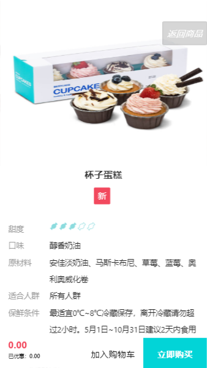
            - 界面简介comment
                >数据的接收：接收从其他的界面传输过来的数据内容并且直接渲染到界面，
                并且可以将商品添加到购物车或者可以从这个界面进行直接的购买
            - 评价界面
            根据各个商品的购买情况和顾客购买后对商品的评价创建了一个可以实时监听到商品的评价状况 
            >   通过接受信息名字来从数据库中获取不同的商品购买后的评价信息

                created() {
                this.id = this.$route.query;
                console.log(this.id);
                axios.get("http://120.24.166.74:3001/getcomment").then((dda) => {
                this.data1 = dda.data
                console.log("dda:", dda.data[0].CmtTime);
                this.time = dda.data[0].CmtTime.slice(6, -2)
                console.log((this.time * 1));
                            })
                          },
            - 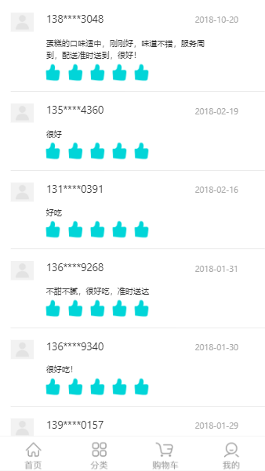
            - 购买界面 PlaceOrder
                >负责从购物车中来拉取数据并且渲染到界面展示
            - 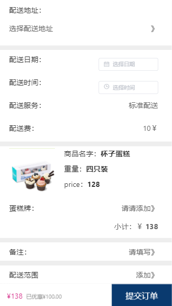
                - 根据不同的商品来进行渲染
                在此界面中可以选择配送的地点，时间。并进行结算。

        * CarouselShow界面
            - CarouselShow界面主要为首页不同的跳转界面，为多个不同种类/类型的商品的详情介绍 
                ```
                    <a href="/" v-show="!isapp">返回首页</a>
                    v-show="!isapp"
                    这里使用v-show的方法实现直接的界面跳转

                ```
                - 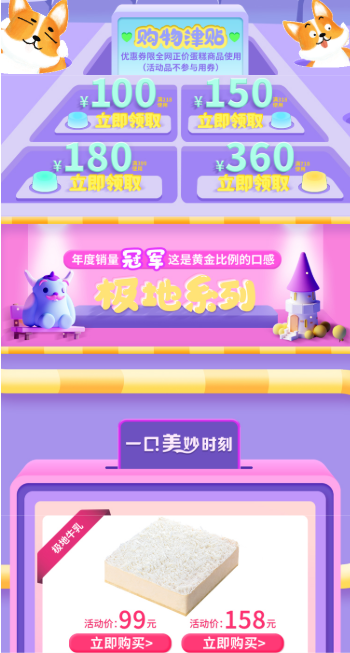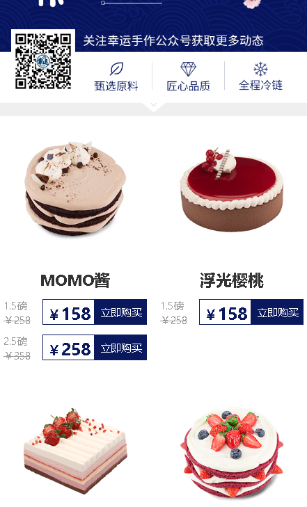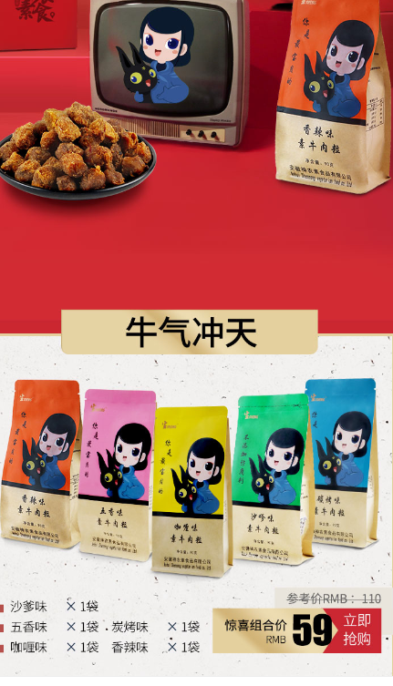 
                
            >拥有很多个不同的样式的CarouselShow界面具体展示的效果为轮播图的跳转的界面效果，此处可以直接的进行购买和领券

## 吴诗雯 
* 分工
    - 负责内容 购物车（shopcar），首页（index），详情页（goodslist）
        - 内容介绍 （index）
        >负责内容从后台管理系统中获取不同的数据并且对主页的界面进行效果的渲染
        - 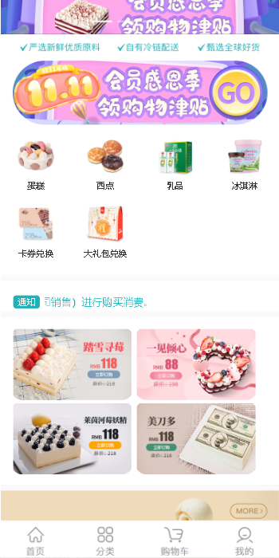 
            ```
                getclassify() {
                    if (this.$store.state.homeData != "") {
                    return this.$store.state.homeData.TopIconList;
                    }
                    return [];
                },
                getspecial() {
                    if (this.$store.state.homeData != "") {
                    return this.$store.state.homeData.CenterContentList;
                    }
                    return [];
                },
                getwonderfulTime() {
                    if (this.$store.state.homeData != "") {
                    //0/null/undefined/""   []
                    let data=JSON.parse(this.$store.state.homeData.SaleList[0].CakeList.replace(/'/g,"\""));
                    return data; //字符串->对象
                    }
                    return []
                },
            ```
        - 界面的数据获取与内容样式
    
    - 详情页goodslist 
        - 商品详情页的制作
            >使用element-ui 来进行布局效果，使用getdata来对界面的数据的请求并且渲染到主界面上 
        - 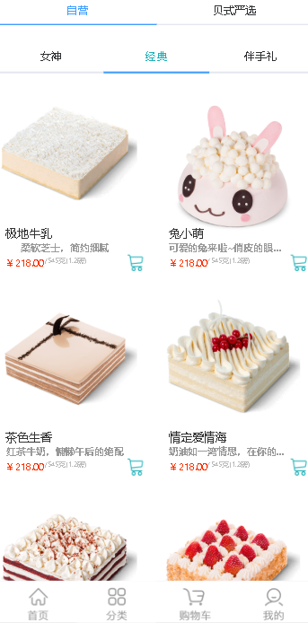 
            ```
                goddessdata() {
                if (this.$store.state.operationData) {
                    return this.$store.state.operationData.filter(  //过滤输出符合条件的数据
                    ele => ele.Brand == "女神系列"
                    );
                }
                return [];
                },
                classicsdata() {
                if (this.$store.state.operationData) {
                    return this.$store.state.operationData.filter(
                    ele => ele.Brand == "卡思客"
                    );
                }
                return [];
                },
                giftdata() {
                if(this.$store.state.operationData){
                    return this.$store.state.operationData.filter(
                    ele => ele.Brand == "极致蛋糕"
                    )
                }
                return [];
                },
                dairydata(){
                if(this.$store.state.operationData){
                    return this.$store.state.operationData.filter(
                    ele => ele.Brand == "乳品系列"
                    )
                }
                return [];
                }
            },
            ```
        - 使用不同的ui效果和数据请求的结果来对数据进行渲染和不同种类的效果的展示

    - shopcar 购物车数据
        - 购物车列表的制作
           >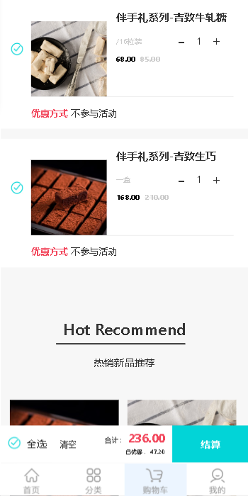 
        ```
                his.showpop = true;
                setTimeout(() => {
                    this.showpop = false;
                }, 1500);
                if (localStorage.getItem("ShoppingCart")) {
                    this.arr = JSON.parse(localStorage.getItem("ShoppingCart"));
                } else {
                    this.arr = [];
                }
                let newdata = JSON.parse(JSON.stringify(item));
                let str = JSON.stringify(this.arr);
                if (str.indexOf(newdata.Name) == -1) {
                    this.arr.unshift(newdata);
                    // 
                    this.$store.commit("addcartnum");
                } else {
                    this.arr.forEach(ele => {
                    if (ele.Name == newdata.Name) {
                        ele.num += 1;
                    }
                    });
                }
                localStorage.setItem("ShoppingCart", JSON.stringify(this.arr));
                let updata = JSON.parse(localStorage.getItem("ShoppingCart"));
                this.datamsg = updata;
        ```
        - 购物车制作是接受来自于CarouselShow，goodslist，goods等多个界面传输过来的数据内容，并且进行实时的更改与数据的渲染内容，并且满足一系列的增加，全选，删除等多种修改的效果内容，和跳转到结算界面结算商品.

## 罗涛
- 负责登陆 注册界面的制作
    > 登陆界面的制作
    -  
    > 通过一系列的表单验证实现登陆界面
       -数据缓存  保存7天
               if (data.data.status === 1) {
                        let Authrization = data.data.token;
                        localStorage.setItem("Authrization", Authrization);

                        let { username } = this.ruleForm;
                        localStorage.setItem("username", username);
                        this.$store.commit("pushusername", username);
                        this.$router.replace({
                            path: "/mine",
                            params: { username },
                            query: { username }
                        });
    - reg界面是从数据库中进行读取存入数据库内部的注册过的数据进行验证，同时可以保存到当前界面的信息。
* 注册界面的制作
    >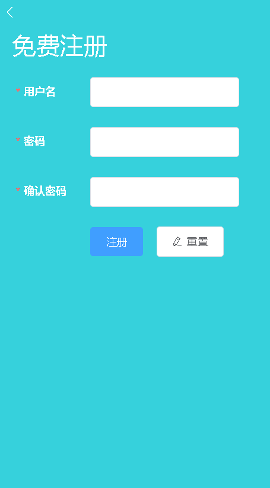 
    - 通过数据的验证和请求注册账户，并且存储到后台数据库中。为后来的登录作为保留
    >   
        - 表单验证数据库验证实现登录界面
            submitForm() {
            //验证整个表单
            this.$refs.regForm.validate(async valid => {
                        if (valid) {
                            let { username, password } = this.ruleForm;
                            let data = await this.postdata(
                                "http://120.24.166.74:3001/register",
                                {
                                    username,
                                    password
                                }
                            );
                            if (data.data.status === 1) {
                                alert("恭喜！注册成功！");
                                this.$router.replace("/log");
                            }
                            if (data.data.status === 0) {
                                alert("用户名已存在！");
                            }
                        } else {
                            return false;
                        }
                    });
                },
                resetForm() {
                    this.$refs.regForm.resetFields();
                }
            }
* 个人信息界面展示
    - 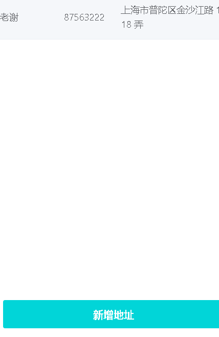 
    - 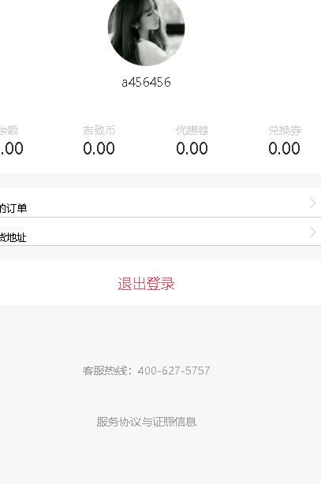 
        >  {
                    name: "老谢",
                    phone: "87563222",
                    address: "上海市普陀区金沙江路 1518 弄"
                }
            - 购买地址通过用户自己来进行改变
        - 可以通过用户自己来设置自己的收货地址和同时观察自己用户的配送状态

##  李浩明
- 负责内容 后台管理系统 - 前端界面整合
###  负责内容一些       
 - 任何人都可以根据后台账户登录，并且个人可以更改商品的信息
    * 前端界面整合 
        - 负责我们每人制作的界面的信息的交互、传递。每个界面的兼容的处理.


    > 后台管理系统 负责管理所有的网页中的全部信息，并且可以根据最新的产品来更改最新的界面信息
        ```
         this.showpop=!this.showpop;
            if(flag==1){
                let data=this.$store.state.indexdata[0]
                data.mainresult.SwiperBannerList[this.selecturl].ImgUrl=this.newurl;
                this.axios.post("http://120.24.166.74:3001/updata",{data:JSON.stringify(data)})
            }
            this.newurl="";
        },
        async upload(index){
            let fd=new FormData();
            fd.set("index",index);
            await this.axios.post("http://120.24.166.74:3001/uploadindex",fd)
        ```
    - 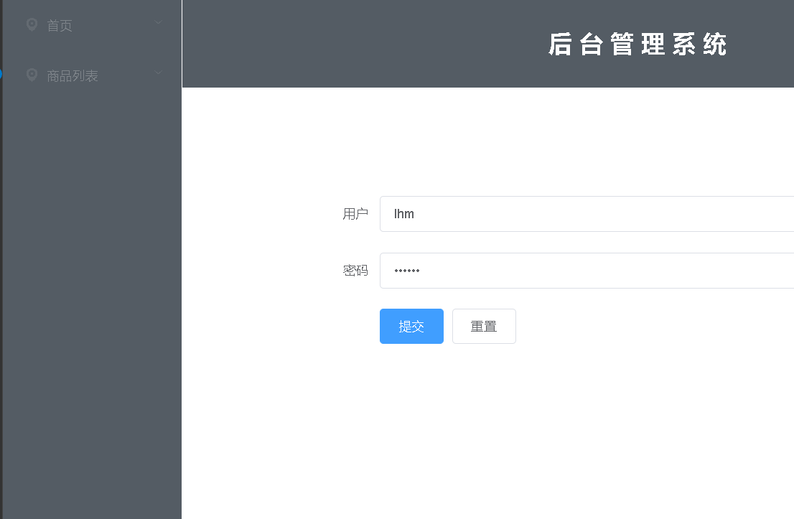 
        ```
            this.showpop=!this.showpop;
            if(flag==1){
                let data=this.$store.state.indexdata[0]
                data.mainresult.TopIconList[this.selectitem]=this.data;
                this.axios.post("http://120.24.166.74:3001/updata",{data:JSON.stringify(data)})
            }
           
        },
        async upload(index){
            let fd=new FormData();
            fd.set("index",index);
            await this.axios.post("http://120.24.166.74:3001/uploadindex",fd)
        }
        ```
    - 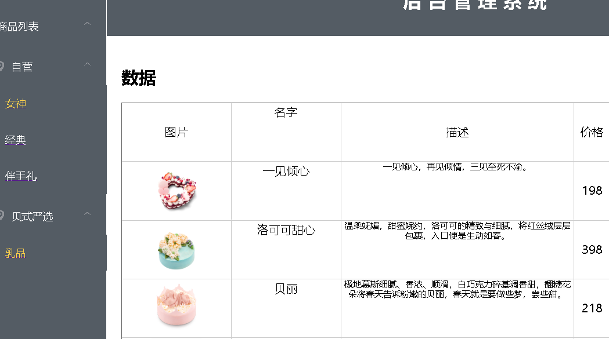 
        ```
         sure(flag){
            this.showpop=!this.showpop;
            if(flag==1){
                let data=this.$store.state.indexdata[0];
                
                
                data.mainresult.SaleList[2].CakeList=JSON.stringify(this.fourdata);
                this.axios.post("http://120.24.166.74:3001/updata",{data:JSON.stringify(data)})
                this.newurl=""
            }
        },
        sureurl(flag){
            this.newurl="";
            this.showpopnew=!this.showpopnew;
            if(flag==1){
                let data=this.$store.state.indexdata[0]
                data.mainresult.SaleList[2].TabImgUrl=this.four1.TabImgUrl;
                this.axios.post("http://120.24.166.74:3001/updata",{data:JSON.stringify(data)})
            }
        },
        getListUrl(name,brand) {
            if (brand == "卡思客") {
                return `https://res.bestcake.com/m-images/ww/jd/${name}.png?`;
            }
            else if (brand == "女神系列") {
                return `https://res.bestcake.com/m-images/ww/ns/${name}.jpg?`;
            }
            else if (brand == "极致蛋糕") {
                return `https://res.bestcake.com/m-images/ww/jz/${name}.png?`;
            }
            else {
                return `https://res.bestcake.com/m-images/ww/rp/${name}.jpg?`;
            }
        }
        },
        computed:{
        four1(){
            if(this.$store.state.indexdata!=""){
                return this.$store.state.indexdata[0].mainresult.SaleList[2]
            }
            return [];
        },
        fourdata(){
            if(this.$store.state.indexdata!=""){
                return JSON.parse(this.$store.state.indexdata[0].mainresult.SaleList[2].CakeList.replace(/'/g,"\""))
            }
            return [];
        }
        }
        ```
    - 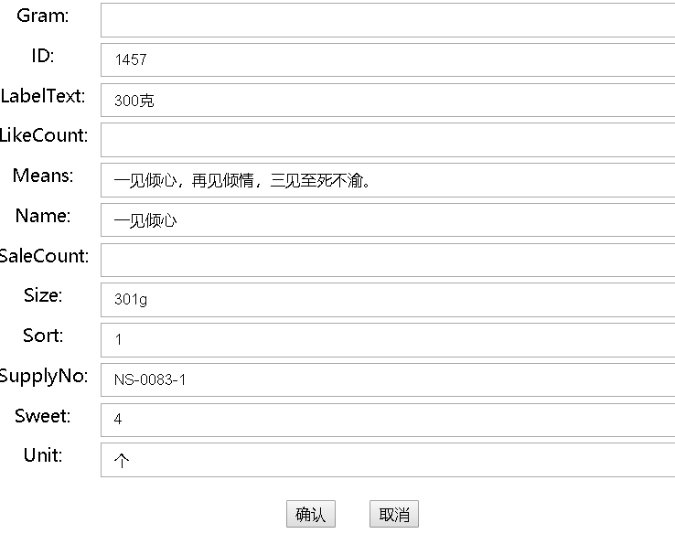 


#                                      结束